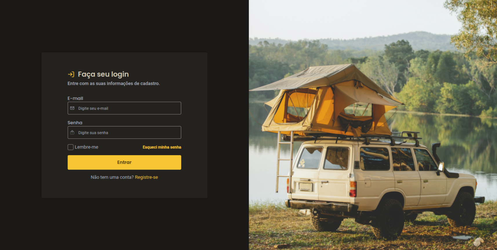

<div align="center" id="top"> 
  

  &#xa0;

  <!-- <a href="https://mydigitalcat.netlify.app">Demo</a> -->
</div>

<h1 align="center">Login Page</h1>

<p align="center">
  

  

  

  

  <!--  -->

  <!--  -->

  <!--  -->
</p>

<!-- Status -->

<h4 align="center"> 
	🚧  Login Page 🚀 Under construction...  🚧
</h4> 

<hr>

<p align="center">
  <a href="#dart-about">About</a> &#xa0; | &#xa0; 
  <a href="#sparkles-features">Features</a> &#xa0; | &#xa0;
  <a href="#rocket-technologies">Technologies</a> &#xa0; | &#xa0;
  <a href="#white_check_mark-requirements">Requirements</a> &#xa0; | &#xa0;
  <a href="#checkered_flag-starting">Starting</a> &#xa0; | &#xa0;
  <a href="#memo-license">License</a> &#xa0; | &#xa0;
  <a href="https://github.com/{{YOUR_GITHUB_USERNAME}}" target="_blank">Author</a>
</p>

<br>

## :dart: About ##

This repository is the answer to the marmitech challenge, proposed by [Jakeline Gracielly](https://github.com/jakeliny), where we should develop a frontend project for [DevChallenge.com.br](https://devchallenge.com.br/) or [Discovery by Rocketseat](https://app.rocketseat.com.br/discover/challenges).
The project consists of a login screen, the manual tells us to work with HTML and CSS, but I went beyond.

## :sparkles: Features ##

:heavy_check_mark: Change form when users click on links to SignUp and Forgot Password;\
:heavy_check_mark: Connect with Firebase authentication;\
:heavy_check_mark: Add dialog (modal) to inform users about account status;

## :rocket: Technologies ##

The following tools were used in this project:

- [React/Vite](https://vitejs.dev/)
- [Tailwind CSS](https://tailwindcss.com/)
- [Headless UI](https://headlessui.dev/)
- [Firebase](https://firebase.google.com/)
- [TypeScript](https://www.typescriptlang.org/)
- [Conventional Commits](https://www.conventionalcommits.org/en/v1.0.0/)

## :white_check_mark: Requirements ##

Before starting :checkered_flag:, you need to have [Git](https://git-scm.com) and [Node](https://nodejs.org/en/) installed.

## :checkered_flag: Starting ##

```bash
# Clone this project
$ git clone https://github.com/mrfelipelima/login-page

# Access
$ cd login-page

# Install dependencies
$ yarn

# You need to rename the '.env.example' file to '.env' and insert your firebase credentials before run

# Run the project
$ yarn dev

# The server will initialize in the <http://localhost:3000>
```

## :memo: License ##

This project is under license from MIT. For more details, see the [LICENSE](LICENSE.md) file.


Made with :heart: by <a href="https://github.com/mrfelipelima" target="_blank">Felipe Lima</a>

&#xa0;

<a href="#top">Back to top</a>
